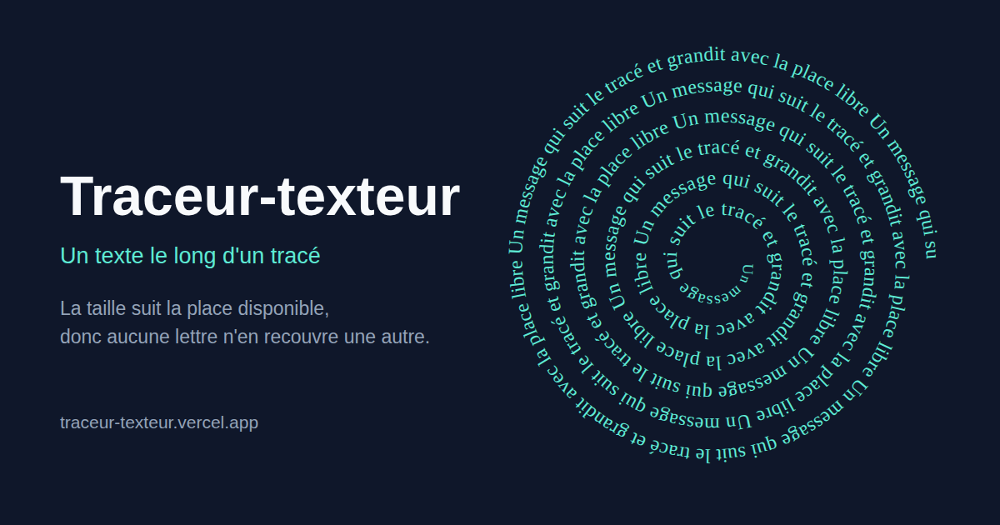

<div align="center">


# Traceur-texteur

**Écrit un message le long d'un tracé, et fait varier la taille des lettres avec la
place réellement disponible, pour qu'aucune n'en recouvre une autre.**

[**Ouvrir l'application**](https://traceur-texteur.vercel.app) &nbsp;·&nbsp;
[Comment ça marche](#comment-ça-marche) &nbsp;·&nbsp;
[Documentation technique](AGENTS.md)

<a href="https://traceur-texteur.vercel.app">
  
</a>

<sub>
  100 % front-end &nbsp;·&nbsp; React 19 + TypeScript &nbsp;·&nbsp;
  zéro dépendance de rendu &nbsp;·&nbsp; licence MIT
</sub>

</div>

---

## Ce que ça fait

Vous donnez un message et une courbe, l'outil pose les lettres dessus. Le tracé vient
de l'une de trois sources :

| Source | Ce que vous faites |
|---|---|
| **Forme** | Choisissez une spirale, un cercle, un rectangle, un triangle ou un zigzag. |
| **Dessin** | Déposez une image au trait : silhouette, logo, coloriage. |
| **À la souris** | Tracez la courbe à main levée, autant de traits que vous voulez. |

Puis vous exportez en **PNG**, **SVG** ou **PDF** prêt à imprimer, au format A4
portrait, A4 paysage ou carré.

Rien ne sort de votre machine. Il n'y a pas de serveur : l'image que vous déposez est
décodée par le navigateur, et tout le calcul se fait dans l'onglet.

## Comment ça marche

Écrire du texte sur un chemin est un problème résolu depuis longtemps : le SVG a
`textPath`, et tous les logiciels de dessin savent le faire. Ce qui n'est pas résolu,
c'est de **remplir une forme de texte lisible**. `textPath` échoue sur les trois
points qui comptent :

1. **Il fait tourner chaque lettre autour de sa ligne de base.** Dans un virage
   serré, elles s'empilent sur le bord intérieur jusqu'à devenir un pâté.
2. **Il ne sait pas changer de taille en cours de route.** Or sur une spirale,
   l'écart entre deux tours se réduit sans arrêt : une taille unique est soit trop
   grosse au centre, soit inutilement timide au bord.
3. **Il ne sait pas remplir.** On lui donne un texte, il l'écrit ; il ne cherche pas
   à occuper la longueur offerte.

D'où le parti pris : **chaque caractère est placé explicitement**, et sa taille est
décidée localement par la place libre autour du tracé.

```
forme | dessin | souris
  └─ cadrage         tout arrive dans le même repère
  └─ échantillonnage un pas constant qui divise la longueur
  └─ virages         les angles trop serrés s'ouvrent pour porter du texte lisible
  └─ place libre     distance à la portion la plus proche du dessin
  └─ taille          min(place, virage), puis lissée
  └─ pose            un caractère après l'autre, avance corrigée de la courbure
  └─ contrôle        les boîtes de lettres se recouvrent-elles ? (réponse : non)
```

La promesse tient en un chiffre, affiché dans l'interface et vérifié à chaque
composition : **le nombre de paires de lettres qui se recouvrent, qui reste à zéro.**
Il est mesuré sur les rectangles orientés réellement posés, pas déduit du calcul qui
les a produits.

### Deux ou trois choses qui n'étaient pas évidentes

- **Ce qui ne doit rien recouvrir, c'est l'encre, pas le corps.** Du bas du `p` au
  sommet du `É`, un texte occupe 1,17 fois son corps en Helvetica. Raisonner sur le
  corps laissait les accents mordre sur la ligne voisine.
- **Les métriques de police sont une table, pas une mesure.** `canvas.measureText`
  dépend des polices installées sur le poste, alors que le PDF est écrit avec les
  métriques Adobe : les deux auraient divergé. D'où trois familles seulement, celles
  des quatorze polices que tout lecteur PDF possède, et un aperçu rigoureusement
  identique au fichier exporté.
- **Dans un angle, mieux vaut élargir le virage que rétrécir le texte.** Sur une
  boucle à pointes, un tiers des lettres tombait sous deux millimètres et demi, donc
  sous le seuil de lisibilité. Le tracé s'ouvre maintenant juste assez pour porter du
  texte lisible, et l'écart au dessin est affiché.
- **Là où rien ne tient, le moteur n'écrit rien** et enjambe, plutôt que d'empiler
  des lettres. La longueur sautée est comptée et montrée.

Le raisonnement complet, les mesures et les pièges rencontrés sont dans
[AGENTS.md](AGENTS.md).

## Démarrer

```sh
make install
make start          # http://localhost:1235
```

| Commande | Effet |
|---|---|
| `make check` | build + lint + typecheck + knip + tests |
| `make test` | tests unitaires et de composants |
| `make bench` | mesure les cas de référence et écrit `out/` |
| `make afm` | régénère les tables de métriques de police |
| `make favicon` | régénère `public/favicon.svg` |
| `make og` | régénère l'image de partage `public/og.png` |

`make help` liste tout.

## Ce que ça vaut

Mesuré par `make bench`, sur A4 portrait, corps maximal 7 mm, en Times.

| Cas | Lettres | Couverture | Corps | Chevauchements |
|---|---:|---:|---|---:|
| spirale, 7 tours | 835 | 100 % | 4,5 à 7,0 mm | **0** |
| spirale, 20 tours | 4158 | 100 % | 2,6 à 4,8 mm | **0** |
| cercle | 215 | 100 % | 7,0 mm | **0** |
| rectangle | 339 | 100 % | 2,8 à 7,0 mm | **0** |
| dessin, contour | 325 | 82 % | 2,6 à 4,7 mm | **0** |

## Limites connues

- **Le texte se retrouve la tête en bas** sur la moitié inférieure d'une forme
  fermée. C'est inhérent à un texte qui suit une courbe fermée, aucun réglage ne
  l'évite.
- **Élargir un angle trahit un peu le dessin**, de l'ordre de deux millimètres. Le
  réglage *Laisser nu* garde le tracé exact, au prix de blancs dans les angles.
- **Le mode « tout le dessin »** rend l'intérieur d'une image mais le découpe en
  dizaines de fragments courts : joli en nuage, ce n'est plus de la lecture.
- **Les mots sont coupés** aux endroits enjambés et aux passages d'un tracé au
  suivant. Aucune césure n'est gérée.

## Licence

[MIT](LICENSE).

---

<div align="center">
  <sub>
    Made with ❤️ by
    <a href="https://github.com/JulienMattiussi/traceur-texteur"><b>YavaDeus</b></a>
  </sub>
</div>
